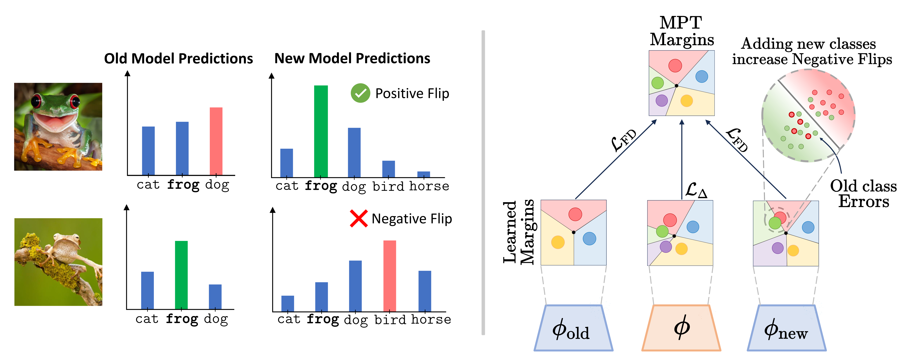

# Mitigating Negative Flips via Margin Preserving Training


[](https://arxiv.org/abs/2511.08322)
[](TODO)

This is the **official repository** of the [**AAAI 2026 paper**](https://arxiv.org/abs/2511.08322) 
"*Mitigating Negative Flips via Margin Preserving Training*" 
by Simone Ricci, Niccolò Biondi, Federico Pernici, and Alberto Del Bimbo

## Overview

### Abstract
Minimizing inconsistencies across successive versions of an AI system is as crucial as reducing the overall error. In image classification, such inconsistencies manifest as negative flips, where an updated model misclassifies test samples that were previously classified correctly. This issue becomes increasingly pronounced as the number of training classes grows over time, since adding new categories reduces the margin of each class and may introduce conflicting patterns that undermine their learning process, thereby degrading performance on the original subset. To mitigate negative flips, we propose a novel approach that preserves the margins of the original model while learning an improved one. Our method encourages a larger relative margin between the previously learned and newly introduced classes by introducing an explicit margin-calibration term on the logits. However, overly constraining the logit margin for the new classes can significantly degrade their accuracy compared to a new independently trained model. To address this, we integrate a double-source focal distillation loss with the previous model and a new independently trained model, learning an appropriate decision margin from both old and new data, even under a logit margin calibration. Extensive experiments on image classification benchmarks demonstrate that our approach consistently reduces the negative flip rate with high overall accuracy.



Schematic overview of the proposed Margin Preserving Training (MPT) approach. A model $\phi$ is trained with the margin-calibrated loss $\mathcal{L}_\Delta$ while receiving double-source focal distillation from two reference models, $\phi_\text{old}$ and $\phi_\text{new}$ (both optimized with cross-entropy). This combination mitigates margin underestimation for new classes, reduces negative flips between model updates, and preserves decision margins for old classes. The gray region marks areas near decision boundaries where negative flips typically occur. Margins are illustrated in a 2D embedding space for clarity, although MPT operates on logit-space margins over all classes.

## Citation
```bibtex
@inproceedings{ricci2026mitigating,
  title={Mitigating Negative Flips via Margin Preserving Training},
  author={Simone Ricci and Niccolo Biondi and Federico Pernici and Alberto Del Bimbo},
  booktitle={Proceedings of the AAAI Conference on Artificial Intelligence},
  year={2026},
  url={https://arxiv.org/abs/2511.08322}
}
```

<details>
<summary><h2>Installation Guide</h2></summary> 

1. Create and Activate Conda Environment
```bash
conda create -y -n lambda_orthogonality python=3.12
conda activate lambda_orthogonality
```

2. Ensure you have the correct version of *PyTorch* and *torchvision*
```bash
# CUDA 12.1
conda install pytorch==2.1.1 torchvision==0.16.1 pytorch-cuda=12.1 -c pytorch -c nvidia
```

3. Cloning Repository and Requirements
```bash
git clone https://github.com/miccunifi/negative_flip_MPT.git
cd negative_flip_MPT/
chmod +x install_requirements.sh
./install_requirements.sh
```

</details>

<details>
<summary><h2>Train Old and New Independently Trained Models</h2></summary>

1. Train the Old model (ResNet-18) on the first half of CIFAR100.
```bash
python train_old_model.py
```

2. Train the New model (ResNet-18) on the full CIFAR100.
```bash
python train_new_model.py
```
Both models will be saved in the `./checkpoint/` directory.
</details>

<details>
<summary><h2>Training and Evaluation of Negative Flip Reduction Methods</h2></summary>

1. Train the model (ResNet-18) using our proposed method, Margin Preserving Training (MPT) with KL as Focal Distillation Loss.

```bash
python main.py --method MPT_KL --b 4.0
```
`--method`: choose the training variant to run. Options used in this project:
  - `No_Treatment` — standard training/finetuning without any negative-flip mitigation (baseline).
  - `PCT_Naive`, `PCT_KL`, `PCT_LM` — Positive Congruent Trainings.
  - `ELODI`, `ELODI_topk` — "ELODI: Ensemble Logit Difference Inhibition for Positive-Congruent Training" (different variants).
  - `MPT_KL`, `MPT_LM` — our Margin Preserving Training (MPT) variants that combine margin calibration with double‑source focal distillation. `_KL` uses KL focal distillation; `_LM` uses the logit‑margin calibration variant.
  - `MPT_nodistillation` — MPT without distillation (ablates distillation contribution).
  - `MPT_KL_nobias`, `MPT_LM_nobias` — MPT variants that disable the bias adjustment on new‑class logits (ablation).

`--b`: scalar bias applied to the new-class logits to help preserve margins of the old model. Effects and tuning guidelines:
  - Purpose: bias modifies the decision boundary between old and new classes to reduce negative flips on previously correct samples.
  - Trade-off: increasing b typically reduces negative flips for old classes but can harm accuracy on newly introduced classes if set too large.
  - Recommended search: grid over {0.0, 1.0, 2.0, 4.0} (the experiments used 4.0 as a representative value). Start from 0.0 (no bias) and 4.0, then refine based on the Negative Flip Rate (NFR) vs overall accuracy with a small Validation Set.

Practical tips
  - Monitor on a small Validation Set both Negative Flip Rate (NFR) and overall accuracy/accuracy on new classes to select the best trade-off.
  - Use a small hyperparameter sweep for `--b` per dataset; the optimal value depends on class imbalance, number of new classes, and model capacity.

ELODI needs to train an ensemble of new models to be put in the folder `./checkpoint/ensemble_models/ckpt_{i}.pth` before running the method.

</details>


## Authors
* [**Simone Ricci**](https://scholar.google.com/citations?user=jtj_lhAAAAAJ&hl)
* [**Niccolò Biondi**](https://scholar.google.com/citations?user=B7VHm9UAAAAJ)
* [**Federico Pernici**](https://scholar.google.com/citations?user=I8nFKUsAAAAJ)
* [**Alberto Del Bimbo**](https://scholar.google.com/citations?user=bf2ZrFcAAAAJ)
